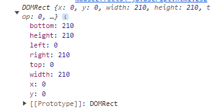

## mouseEffect 학습 저장소

### 01. jQuery hover 문법

- 문법
```javascript
$(".select").hover(
    function() {}, // mousehover 했을 때
    function() {}, // mouseout 되었을 때
)
```

- 예시
```javascript
$(".mouseCont span").hover(
    function() { 
        $(".cursor").addClass($(this).attr("class")); 
    }, 
    function() { 
        $(".cursor").removeClass($(this).attr("class"));
    }
);

```        
---

### 02. gsap 문법
- duration 효과
    duration의 값을 각각 다르게하여 챕터2의 따라다니기 기능 구현 가능
```javascript
    gsap.to(cursor, {
        duration:0.3, 
        left: e.pageX -5, 
        top: e.pageY - 5,
    });

    gsap.to(follower, {
        duration:0.8, 
        left: e.pageX - 15, 
        top: e.pageY - 15,
    });
```

---

### 03. 마우스 커서 브랜딩 효과
```css
    .cursor {
        position: absolute;
        left: 0; top: 0;
        width: 10px;
        height: 10px;
        border-radius: 50%;
        z-index: 9999;
        background-color: #fff;
        user-select: none;
        pointer-events: none;
        transition: transform 0.3s;
        mix-blend-mode: difference;
    }
```

- 주목 코드 : mix-blend-mode: difference;
- 이 코드는 자신의 배경과 그 위의 요소의 배경을 혼합하는 디자인 효과를 줄 수 있음.
    
---

### 04-01. 조명 효과

```css
    .cursor{
        position: absolute;
        width: 200px;
        height: 200px;
        border-radius: 50%;
        border: 5px solid #fff;
        background-image: url(./img/bg6.jpg);
        background-size: cover;
        background-position: center;
        background-repeat: no-repeat;
        background-attachment: fixed;
        z-index: -1;
    }
```

- 주목 코드 : background-attachment: fixed;
- 배경 이미지가 움직이지 않고 고정되게 하는 코드이다. 사용자가 페이지를 스크롤해도 배경 이미지는 움직이지 않고 화면에 고정된다.

- 배경이미지가 뒤에 있는 디자인 효과를 줄 수 있다.

---

### 04-02 요소의 가로 세로값 구하는 법 javascript 고급편
```javascript
    const circle = cursor.getBoundingClientRect();
    
    gsap.to(cursor, {
        duration:0.3,
        left:e.pageX - circle.width/2,
        top:e.pageY - circle.height/2,
    });
```
getBoundingClientRect함수를 사용하여 출력해보면
<br />

 <br />
이런 값이 나온다.


### 05 기준점을 정중앙으로 잡기
```javascript
    let standardX = window.innerWidth / 2 - e.pageX;
    let standardY = window.innerHeight / 2 - e.pageY

    gsap.to(".mImg img", {
        x: standardX / 10,
        y: standardY / 10,
        duration:0.5,
    })

/*  
    mouseEffect05-javascript.html 파일을 실행하여 마우스 커서를 정중앙에 놓으면 
    좌측하단의 standardX ,Y 값이 0에 가깝게 나오는데 이 원리는 

    전체 가로 값을 800이라 치고 "window.innerWidth / 2" 는 400이다.
    마우스 커서를 "중앙"으로 오게하면 마우스 기준에서 마우스 좌표 값은 400이 된다. 
    따라서 window.innerWidth / 2 - e.pageX; 이 코드는
                            400 - 400 이다.
                    
    그렇기 때문에 마우스를 최대한 정중앙으로 이동시키면 standardX,Y 값은 0, 0에 가깝게 된다.

    그 후 최종적으로 이미지 요소의 x와 y 좌표 값에 마우스가 이동한 만큼 
    값을 주면 너무 빨리 변하니 이동한 마우스 값의 /10 이나 /20으로 조금만
    이동시키면 효과가 완성된다.
*/
```
